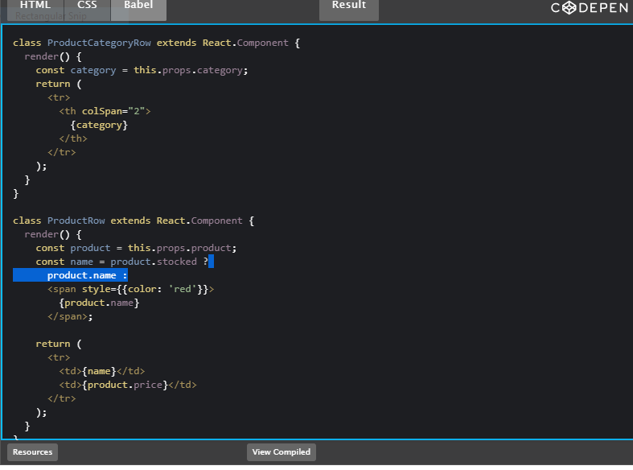

# A Mock

> The MockServerRule starts MockServer (for both mocking and proxying) on a free port before the any test runs and stops MockServer after all tests have completed ...

## how start the A Mock ?

MockServer can be run from the command line in the following ways:

1. using homebrew i.e. brew install mockserver && mockserver.

2. using java directly i.e. java -jar mockserver-netty-5.11. 1-jar-with-dependencies. ...

3. using maven plugin i.e. mvn org. ...

4. using docker i.e. docker run -d --rm -p mockserver/mockserver.

> The original list of products is passed in as props, so that’s not state. The search text and the checkbox seem to be state since they change over time and can’t be computed from anything. And finally, the filtered list of products isn’t state because it can be computed by combining the original list of products with the search text and value of the checkbox.

## single responsibility principle

> The single-responsibility principle (SRP) is a computer-programming principle that states that every module, class or function in a computer program should have responsibility over a single part of that program's functionality, and it should encapsulate that part. All of that module, class or function's services should be narrowly aligned with that responsibility.

# static version 

> n a statically built program, no dynamic linking occurs: all the bindings have been done at compile time. ... As a result, when installing a statically-built program on a computer, the user doesn't have to download and install additional libraries: the program is ready to run.
and also 
>Static applications and websites render in the user's browser without the need for server side processing, this means that all the rendering of HTML, CSS, and JavaScript is done on the client side, rather then relying on server side technologies.

## how we determain the state ?

1. what is it doing ?

2. how its working ?

3. the defination of it ?

## How can you identify where state needs to live?

> we can know that if the object have to change some of what he have . vote .number. chape aof it .

for more info please visit my github

[qusaiqeisi](https://github.com/qusaiqeisi)

***best regard***
